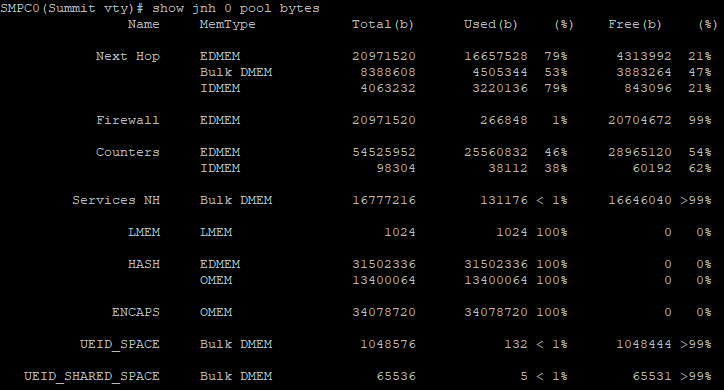

# IPFIX/NetFlow configuration template

This is currently specific to an mx204 with the [nfdump](https://github.com/phaag/nfdump) toolkit.

```
chassis {
    fpc 0 {
        sampling-instance default;
        inline-services {
            flow-table-size {
                ipv4-flow-table-size 10;
                ipv6-flow-table-size 5;
            }
        }

    }
}

services {
    flow-monitoring {
        version-ipfix {
            template v4 {
                ipv4-template;
            }
            template v6 {
                ipv6-template;
            }
        }
    }
}

forwarding-options {
    sampling {
        sample-once;
        instance {
            default {
                input {
                    rate 100;
                }
                family inet {
                    output {
                        flow-server 192.0.2.1 {
                            port 9995;
                            version-ipfix {
                                template {
                                    v4;
                                }
                            }
                        }
                        inline-jflow {
                            source-address 198.51.100.1;
                        }
                    }
                }
                family inet6 {
                    output {
                        flow-server 192.0.2.1 {
                            port 9995;
                            version-ipfix {
                                template {
                                    v6;
                                }
                            }
                        }
                        inline-jflow {
                            source-address 198.51.100.1;
                        }
                    }
                }
            }
        }
    }
}

# measurement rules are good to add as the first in interface filter input-list
firewall {
    family inet {
        filter measurement-v4 {
        interface-specific;
            # ...
            term default {
                then {
                    count packets;
                    sample;
                    next term;
                }
            }
        # ...
    }
    family inet6 {
        filter measurement-v6 {
        interface-specific;
            #...
            term default {
                then {
                    count packets;
                    sample;
                    next term;
                }
            }
        # ...
    }
}
```

## useful Junos commands

* flow export statistics:\
   `show services accounting flow inline-jflow fpc-slot 0`
* flow export status:\
  `show services accounting status inline-jflow fpc-slot 0`
* flow export errors:\
  `show services accounting errors inline-jflow fpc-slot 0`
* clear flow state:\
  `clear services accounting flow inline-jflow fpc-slot 0`
* show routing engine CPU, memory, and related state:\
  `show chassis routing-engine`
* show FPC CPu, memory, and related state:\
  `show chassis fpc`

See notes below for a deeper look at flow table sizing information and FPC detail.

## References

* [IETF RFC 5153 - IP Flow Information Export (IPFIX) Implementation Guidelines](https://tools.ietf.org/html/rfc5153)
* [IETF RFC 5474 - A Framework for Packet Selection and Reporting](https://tools.ietf.org/html/rfc5474)
* [IETF RFC 5655 - Specification of the IP Flow Information Export (IPFIX) File Format](https://tools.ietf.org/html/rfc5655)
* [IETF RFC 7011 - Specification of the IP Flow Information Export (IPFIX) Protocol for the Exchange of Flow Information](https://tools.ietf.org/html/rfc7011)
* [IETF RFC 7012 - Information Model for IP Flow Information Export (IPFIX)](https://tools.ietf.org/html/rfc7012)
* [An introduction to IP flow information export (IPFIX)](https://ieeexplore.ieee.org/document/5741152/) - Trammel, B., Boschi, E., IEEE Communications Magazine, Volume 49, Issue 4
* [Flow Monitoring Explained: From Packet Capture to Data Analysis With NetFlow and IPFIX](https://ieeexplore.ieee.org/document/6814316/) - Hofstede, R., et al., IEEE Communications Surveys & Tutorials, Volume 16, Issue 4
* [Flow-Based Measurement: IPFIX Development and Deployment](https://search.ieice.org/bin/summary.php?id=e94-b_8_2190) - Brownlee, Neil, IEICE Transactions on Communications, Volume E94-B, Number 8
* [Measurement Artifacts in NetFlow Data](http://link.springer.com/chapter/10.1007/978-3-642-36516-4_1) - Hofstede, R., et al., PAM 2013
* [A survey of network flow applications](https://www.sciencedirect.com/science/article/pii/S1084804512002676) - Li, B., et al.,  Journal of Network and Computer Applications, March 2013
* [Tracking incidents with NfSen](https://tnc2008.terena.org/core/getfile2d12.pdf?file_id=253) - Haag, P., TNC 2008
* [An Overview of IP Flow-Based Intrusion Detection](https://ieeexplore.ieee.org/document/5455789/) - Sperotto, A., et al., IEEE Communications Survey & Tutorials, 2010
* [The Network Data Handling War: MySQL vs. NfDump](https://link.springer.com/chapter/10.1007/978-3-642-13971-0_16) - Hofstede, R., et al., EUNICE 2010
* [IANA registry of IP Flow Information Export (IPFIX) Entities](https://www.iana.org/assignments/ipfix/ipfix.xhtml)
* [Junos Monitoring, Sampling, and Collection Services Interfaces Feature Guide](https://www.juniper.net/documentation/en_US/junos/information-products/pathway-pages/services-interfaces/flow-monitoring.pdf)
* [Configuring Flow Aggregation to Use IPFIX Flow Templates on MX, vMX and T Series Routers, EX Series Switches and NFX250](https://www.juniper.net/documentation/en_US/junos/topics/task/configuration/services-ipfix-flow-template-flow-aggregation-configuring.html)
* [Junos flow-monitoring configuration documentation](https://www.juniper.net/documentation/en_US/junos/topics/reference/configuration-statement/flow-monitoring-edit-services.html)
* [Configuring Traffic Sampling on MX, M and T Series Routers](https://www.juniper.net/documentation/en_US/junos/topics/usage-guidelines/services-configuring-traffic-sampling.html)
* [Configuring Inline Active Flow Monitoring Using Routers, Switches or NFX250](https://www.juniper.net/documentation/en_US/junos/topics/task/configuration/inline-flow-monitoring.html)
* [Multiservices MIC and Multiservices MPC (MS-MIC and MS-MPC) Overview](https://www.juniper.net/documentation/en_US/junos/topics/concept/ms-mic-and-mpc-overview.html)
* [Router Flow Configs](https://kb.kentik.com/Bd02.htm) - router configuration guidance from Kentik
* [Using NfSen](https://nsrc.org/workshops/2017/apricot2017/nmm/netmgmt/en/netflow/exercise4-using-NfSen.pdf) - workshop presentation from NSRC

## Junos flow table and FPC detail

Juniper provided the followed additional technical information about the flow tables and FPC support.

Flow table size is defined in blocks of 256*1024 flows. The memory is calculated different.  Sampling flows records are created and stored in hash tables stored in EDMEM and OMEM (Optional Memory):

* OMEM is used to store JFLOW information
* EDMEM is used as bucket memory (counters for the flows stored on OMEM)

OMEM is reserved for Hash Table (record memory). Size is 256MB.  Hash table size define the maximum number of flows that might be recorded at any given time.  For example, if you configure 15 blocks for IPv4, you will sample ~3.96 Mflows (256*1024*15).  We have two mutually exclusive modes of flow table sizing:

1. Manually specify per family flow table size.
   1. Only one block is created with the sum of block sizes specified for all the families.
   1. Separate space reserved for each family
1. New knob “chassis fpc <X> inline-services flex-flow-sizing”
   1. 4M entries allocated to single flow table
   1. Flows are added on a first-come-first-served basis
   1. If flow table becomes full an error counter will be incremented
   1. No separate space reserved for any family

In the following image, you will see the difference between the mode of flow table sizing:



